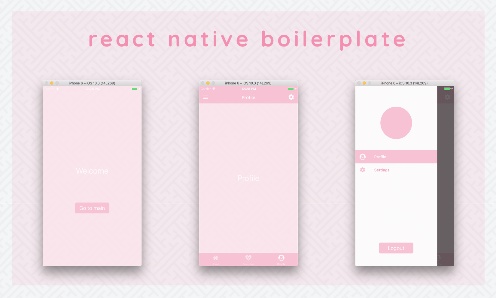

# React Native Boilerplate

[](https://david-dm.org/bkdev98/react-native-boilerplate/status.svg)
[](https://david-dm.org/bkdev98/react-native-boilerplate?type=dev)
[](#badge)
[](https://github.com/EQuimper/eslint-config-equimper)
[](http://makeapullrequest.com)

> A React Native boilerplate with Expo, Redux, React Navigation, Styled Components and some 💕 included.



## Demo

- Run with Expo: [React Native Boilerplate]

## Technologies
- [React Native (Expo)](https://docs.expo.io/versions/v18.0.0/index.html)
- [React Navigation](https://reactnavigation.org/)
- [Redux](redux.js.org)
- [Styled Components](https://www.styled-components.com/)
- [ESLint](https://github.com/eslint/eslint) & [Prettier](https://github.com/prettier/prettier)

## Getting Started
Clone this repository
```
$ git clone git@github.com:udman/prosperna_mobile_ios.git new-project
```
Install node modules, [Yarn](https://yarnpkg.com/en/) is highly recommended.
```
$ yarn
```
Open and start project using [Expo XDE](https://expo.io/tools) or use the [CLI](https://github.com/expo/exp) :
```
$ expo start
```
Run on Android/iOS device or simulator
```
$ expo ios
$ expo android
```
Open project in any [code](https://code.visualstudio.com/) editors and have fun 🍻

## Contribution
All PRs are welcome 💕

## Contact
- [Facebook](https://www.facebook.com/localhost8001)

## Important Note Change the slug in app.json when you want to live

# iOS
```
$  "slug": "prosperna_mobile_ios"
```

# Android
```
$  "slug": "prosperna"
```

# Staging
```
$  "slug": "prosperna"
```

expo account
user name : joshuaprosperna
password: joshuaprosperna1234

Get the SHA-1 Fingerprint Certificate of App  for Google Sign in
$ keytool -list -printcert -jarfile <FILE_NAME>.apk

$ MD5:  6F:8B:F5:D6:F1:87:8C:CE:26:C7:A0:65:08:6C:A2:BB
$ SHA1: E3:C2:F3:1E:0D:06:0B:49:61:69:98:3A:5E:6D:DE:7B:77:C7:A6:23
$ SHA256: 93:CB:D6:05:38:E8:71:E3:4E:FA:F5:FC:AA:32:6D:72:9C:AB:AC:0A:9D:D7:99:0E:09:DB:CB:15:76:D5:E3:E8

